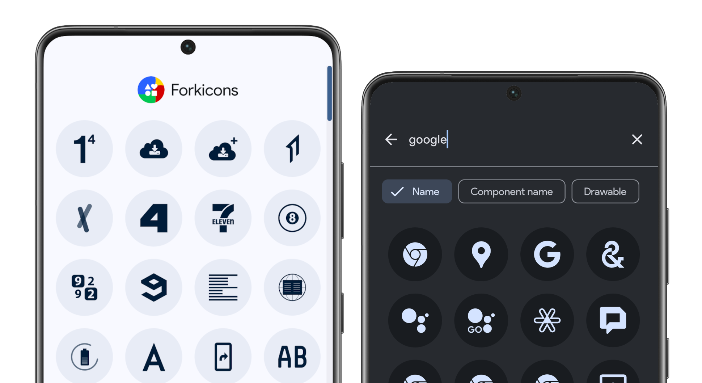

    
  
  
  
  

 

Forkicons is a fork of [Lawnicons](https://github.com/LawnchairLauncher/lawnicons), an icon pack developed by the Lawnchair team, and supported by the community. Originally an addon for Lawnchair 12 Alpha 5 and above to implement themed icons, it can now be used on many launchers.

_Forkicons restores the original themed icons of apps and adds icons for apps that doesn't have one, instead of the outlined icons in the original Lawnicons._

Try Forkicons [on the latest version of Lawnchair](https://play.google.com/store/apps/details?id=app.lawnchair.play). You can enable themed icons by going to `Home Settings → General → Icon Style` and choosing the desired option.

## Download

  
  

**Development builds**

[nightly.link](https://nightly.link/k4ustu3h/forkicons/workflows/build_debug_apk/main/Debug%20APK) • [Obtainium](https://apps.obtainium.imranr.dev/redirect?r=obtainium://app/%7B%22id%22%3A%22app.lawnchair.forkicons%22%2C%22url%22%3A%22https%3A%2F%2Fgithub.com%2FLawnchairLauncher%2Flawnicons%22%2C%22author%22%3A%22LawnchairLauncher%22%2C%22name%22%3A%22Lawnicons%22%2C%22preferredApkIndex%22%3A0%2C%22additionalSettings%22%3A%22%7B%5C%22includePrereleases%5C%22%3Atrue%2C%5C%22fallbackToOlderReleases%5C%22%3Atrue%2C%5C%22filterReleaseTitlesByRegEx%5C%22%3A%5C%22Lawnicons%20Nightly%5C%22%2C%5C%22filterReleaseNotesByRegEx%5C%22%3A%5C%22%5C%22%2C%5C%22verifyLatestTag%5C%22%3Afalse%2C%5C%22dontSortReleasesList%5C%22%3Afalse%2C%5C%22useLatestAssetDateAsReleaseDate%5C%22%3Afalse%2C%5C%22trackOnly%5C%22%3Afalse%2C%5C%22versionExtractionRegEx%5C%22%3A%5C%22%5C%22%2C%5C%22matchGroupToUse%5C%22%3A%5C%22%5C%22%2C%5C%22versionDetection%5C%22%3Afalse%2C%5C%22releaseDateAsVersion%5C%22%3Atrue%2C%5C%22useVersionCodeAsOSVersion%5C%22%3Afalse%2C%5C%22apkFilterRegEx%5C%22%3A%5C%22%5C%22%2C%5C%22invertAPKFilter%5C%22%3Afalse%2C%5C%22autoApkFilterByArch%5C%22%3Atrue%2C%5C%22appName%5C%22%3A%5C%22Lawnicons%20Nightly%5C%22%2C%5C%22shizukuPretendToBeGooglePlay%5C%22%3Afalse%2C%5C%22allowInsecure%5C%22%3Afalse%2C%5C%22exemptFromBackgroundUpdates%5C%22%3Afalse%2C%5C%22skipUpdateNotifications%5C%22%3Afalse%2C%5C%22about%5C%22%3A%5C%22%5C%22%7D%22%2C%22overrideSource%22%3Anull%7D) • [GitHub](https://github.com/k4ustu3h/forkicons/releases/tag/nightly)

## Contributing

You can contribute by adding icons and solving development issues. Please see our guidelines for more info.

[Forkicons guidelines](CONTRIBUTING.md) (updated: May 2025) • [Link apps and icons](CONTRIBUTING.md#adding-icons-and-missing-app-components-to-forkicons)

## Requesting icons

`Open Forkicons 2.13+ → Tap "Request icons" → Submit the response`

[Report outdated icons](https://github.com/k4ustu3h/forkicons/issues)

## Credits

-   [Lawnicons](https://github.com/LawnchairLauncher/lawnicons)
-   [RKicons](https://github.com/RadekBledowski/rkicons) - The first Lawnicons fork that restored the original icons.
