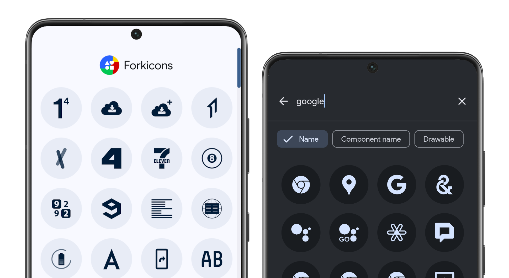

    
  
  
  

 

Forkicons is a fork of [Lawnicons](https://github.com/LawnchairLauncher/lawnicons), an icon pack developed by the Lawnchair team, and supported by the community. Originally an addon for Lawnchair 12 Alpha 5 and above to implement themed icons, it can now be used on many launchers.

_Forkicons restores the original themed icons of apps and adds icons for apps that doesn't have one, instead of the outlined icons in the original Lawnicons._

Forkicons is best used [on the latest version of Lawnchair](https://play.google.com/store/apps/details?id=app.lawnchair.play). You can enable themed icons on Lawnchair by going to `Home Settings → General → Icon Style` and choosing the desired option.

## Download

  
  

**Development builds:** [nightly.link](https://nightly.link/k4ustu3h/forkicons/workflows/build_debug_apk/main/Debug%20APK)

## Contributing

Please see our guidelines for information on contributing icons or code, it will save you time. We put the quality of icons first, so the requirements are relatively strict. Let us know if the guidelines are unclear somewhere so that we can clarify them.

[Forkicons guidelines](CONTRIBUTING.md) • [Development issues](https://github.com/k4ustu3h/forkicons/issues)

## Requesting icons

[Report outdated icons](https://github.com/k4ustu3h/forkicons/issues/new?assignees=&labels=icon+update&projects=&template=icon_rebrand.yml)

## Credits

-   [Lawnicons](https://github.com/LawnchairLauncher/lawnicons)
-   [RKicons](https://github.com/RadekBledowski/rkicons) - The first Lawnicons fork that restored the original icons.
